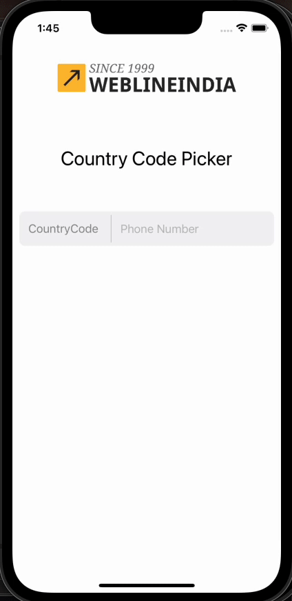

# SwiftUI Country Code Picker

This Country Code Picker is a fully reusable demo that provides users with a convenient way to select and display country codes from a comprehensive list. It simplifies the process of selecting the correct country code and thier flag as well.

## Table of Contents 

- [Demo](#demo)
- [Features](#features)
- [Installation](#installation)
- [Usage](#usage)
- [Contributing](#contributing)
- [Need Help / Support?](#need-help)
- [Collection of Components](#collection-of-Components)
- [License](#license)
- [Acknowledgements](#acknowledgements)
- [Keywords](#keywords)

# Demo 📱

This demo contains a screen which have country code selection and input field to enter mobile number.




# Features 🥳

App has main feature as:

* Country code picker feature.
* Demo has signle screen with country code selection and one input field of mobile number.
* Multiselection flag available to select multiple country code.
* Fully customization available.
* Not any third party dependency.
* Minimum iOS Target 16.0

# Installation 💾

The instructions on how to install or run this demo:

* Clone the repository.
* Open the project in Xcode.
* Build and run the project.

# Usage & Integration 👩🏾‍🔬

How to add the country code picker feature into your own SwiftUI project. follow below steps

** Create your new SwiftUI project with main app content view.
** Drag and drop folder name as `CountryPickerSource` source of files into your project. That contains all necessary files which needed for picker.

** `CountryPickerRepresentable` - This File is using for swiftUI to present the view controller.
** `CountryModel` - This file is using for JSON parsing of country list. 
** `CountryCodes` - This is JSON file of country list.
** `Countries` - Array of country model object.
** `CountriesViewController` - This file using to present the screen and render country data.
** `Country` - Using to extract particular data as country name, code and flag by defining methods. 
** `CountriesViewControllerDelegate` - This contains the delegate methods of CountriesViewController
** `SwiftyJSON`  This is one type of helper which is using for parsing of json data.

### Put the code into your initial content view:
Here integreated country picker on taping of a button and display data as flag and code after selection. And additionaly added one input field for mobile number.

```swift
struct ContentView: View {
@State private var selectedCountry: CountryModel?
@State private var isPickerVisible = false
@State private var mobile = ""

var body: some View {

VStack(alignment: .center, spacing: 50) {
Image("logo").frame(width: 200,height: 100,alignment: .center)
Text("Country Code Picker")
.font(.title)
.foregroundColor(.primary)
HStack {
Button(action: {
isPickerVisible.toggle()
}) {
HStack {
Text(selectedCountry?.countryFlag ?? "")
.frame( height: 20)

Text(selectedCountry?.countryCode ?? "CountryCode")
.foregroundColor(.gray)
}.padding(5)
}
Divider().background(Color.gray)
.frame(width: 1).padding(5)
TextField("Phone Number", text: $mobile)
}.frame(height: 50)
.background(Color.secondary.opacity(0.1))
.cornerRadius(8)
.padding(10)
Spacer()

}.sheet(isPresented: $isPickerVisible) {
CountryPicker(country: $selectedCountry)
}
}
}

```
** `CountryPickerRepresentable` This file can modify as per requirement and customise the feature, by default its single selection of picker but its support multiple selection.

```swift

struct CountryPicker: UIViewControllerRepresentable {
let countryPicker = CountriesViewController()
@Binding var country: CountryModel?

func makeUIViewController(context: Context) -> CountriesViewController {
countryPicker.allowMultipleSelection = false
countryPicker.delegate = context.coordinator
return countryPicker
}

func updateUIViewController(_ uiViewController: CountriesViewController, context: Context) {
}

func makeCoordinator() -> Coordinator {
return Coordinator(self)
}

class Coordinator: NSObject, CountriesViewControllerDelegate {
func countriesViewControllerDidCancel(_ countriesViewController: CountriesViewController) {
}

func countriesViewController(_ countriesViewController: CountriesViewController, didSelectCountry country: Country) {
let cModel = CountryModel()
if let info = getCountryAndName(country.countryCode) {
cModel.countryCode  = info.countryCode!
cModel.countryFlag  = info.countryFlag!
}
parent.country = cModel
}

func countriesViewController(_ countriesViewController: CountriesViewController, didUnselectCountry country: Country) {
}

func countriesViewController(_ countriesViewController: CountriesViewController, didSelectCountries countries: [Country]) {
}

var parent: CountryPicker
init(_ parent: CountryPicker) {
self.parent = parent
}
}
}

```

## UIKit - Swift Integration

And also we can use same Source library for UIKit in swift project as well. Write below code to open country picker.

```swift
DispatchQueue.main.async {
CountriesViewController.show(countriesViewController: self.countriesViewController, toVar: self)
} 

```

# Contributing

- Created something awesome, made this code better, added some functionality, or whatever (this is the hardest part).
- [Fork it](http://help.github.com/forking/).
- Create new branch to contribute your changes.
- Commit all your changes to your branch.
- Submit a [pull request](http://help.github.com/pull-requests/).


# Need Help? 

We also provide a free, basic support for all users who want to use this coordinator master demo in project. In case you want to customize this demo input to suit your development needs, then feel free to contact our [iOS SwiftUI Developers](https://www.weblineindia.com/hire-ios-app-developers.html).

# Collection of Components

We have built many other components and free resources for software development in various programming languages. Kindly click here to view our [Free Resources for Software Development.](https://www.weblineindia.com/software-development-resources.html)

# Changelog

Detailed changes for each release are documented in [CHANGELOG](./CHANGELOG).

# License 📃

This project is licensed under the MIT License. Feel free to use, modify, and distribute the code as permitted by the license.

# Acknowledgements

This app was created using SwiftUI and leverages various libraries and resources. We would like to acknowledge and express our gratitude to the following:
* SwiftUI: Apple's declarative framework for building user interfaces.
* Xcode: Integrated development environment (IDE) provided by Apple.
* Open-source libraries: Various open-source libraries and frameworks used in the project.
* Community contributors: Contributors who have provided support, bug fixes, and enhancements.

# Keywords

Country Picker Master, SwiftUI Country Code Picker, Country Picker Reusable Component, Country Code, Swift5, iOS 16, WeblineIndia
